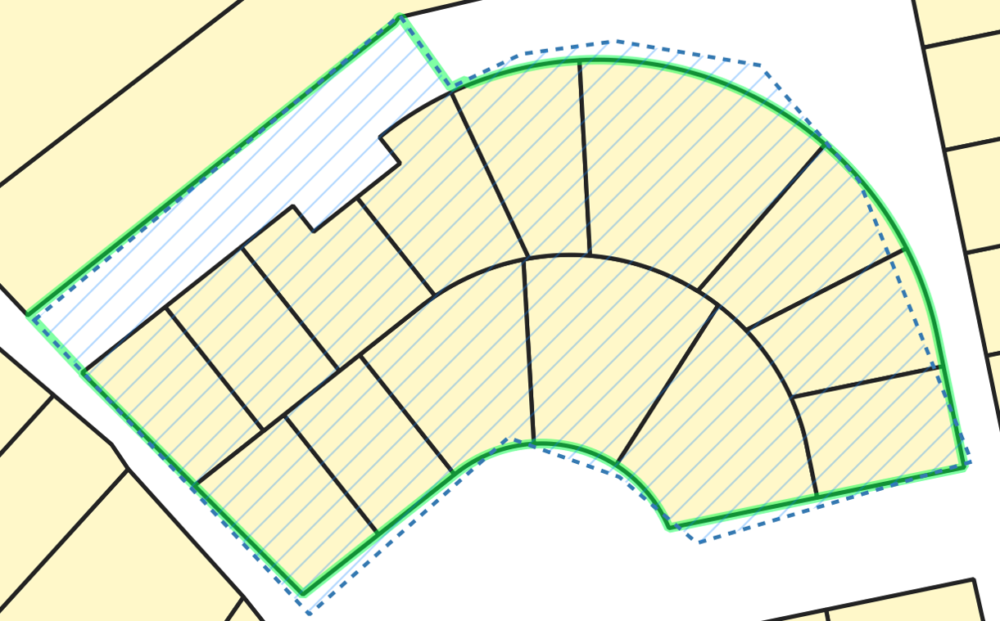
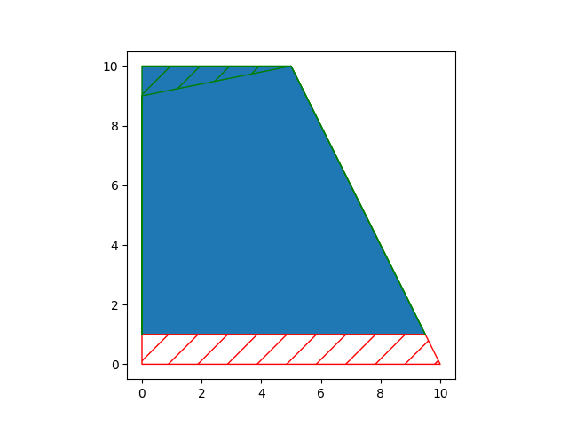
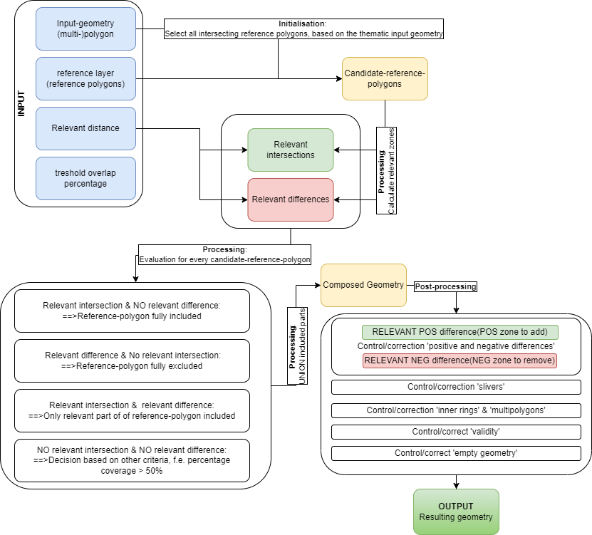
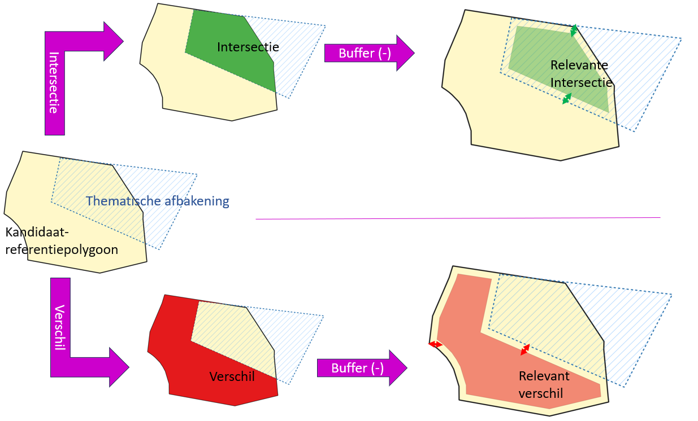
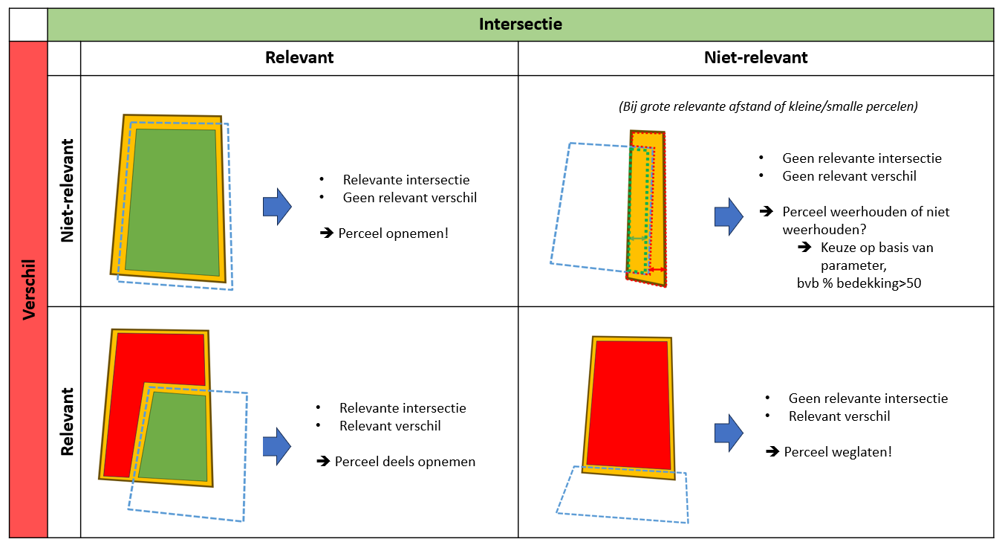

# `brdr`

a Python library to assist in realigning (multi-)polygons (OGC Simple Features) to reference borders

<!-- badges: start -->


[](https://doi.org/10.5281/zenodo.11385644)

<!-- badges: end -->

Quick links:

- [Installation](#installation)
- [Development](#development)
- [Issues, questions, comments and contributions](#comments-and-contributions)

## Description

### Intro

`brdr` is a Python package that assists in aligning geometric boundaries to reference boundaries. This is an important
task in geographic data management to enhance data quality.

* In the context of geographic data management, it is important to have accurate and consistent boundaries for a variety
  of applications such as calculating areas, analyzing spatial relationships, and visualizing and querying geographic
  information.
* When creating geographic data, it is often more efficient to derive boundaries from existing reference data rather
  than collecting new data in the field.
* `brdr` can be used to align boundaries from new data to reference data, ensuring that the boundaries are accurate and
  consistent.

### Example

The figure below shows:

* the original thematic geometry (blue),
* A reference layer (yellow-black).
* The resulting geometry after alignment with `brdr` (green)



### Functionalities

`brdr` provides a variety of functionalities in the Aligner-class to assist in aligning boundaries, including:

* Loaders:
    * aligner.load_thematic_data():Loading thematic data ((Multi-)Polygons) as a dictionary (DictLoader) or geojson (
      GeoJsonFileLoader,GeoJsonUrlLoader)
    * aligner.load_reference_data():Loading reference data ((Multi-)Polygons) as a dictionary (DictLoader) or geojson (
      GeoJsonFileLoader,GeoJsonUrlLoader)

* Processors:
    * aligner.process(): Align thematic boundaries to reference boundaries with a specific relevant
      distance or a range of relevant distances
    * aligner.predictor(): Searches all 'stable' (=predicted) processresults in a range of relevant distances
    * aligner.get_brdr_formula(): Calculating a descriptive formula of a thematic boundary based on a reference layer
    * compare(): Compares input geometries with another version and adds a EVALUATION_FIELD_NAME
* Exporters:
    * aligner.get_results_as_geojson(): Returns a collection of geojson-dictionaries with the processresults (resulting
      geometry, differences,...): This can be used for all processresults or only the 'predicted' results
    * aligner.get_input_as_geojson(): Returns a geojson-featurecollection from input-dictionaries (thematic or
      reference)
    * aligner.save_results(): Exports the resuling geojson-files to a specified path:This can be used for all
      processresults or only the 'predicted' results

Besides the generic functionalities, a range of Flanders-specific functionalities are provided:

* Loaders:
    * GRBActualLoader: Loading actual GRB (parcels, buildings)
    * GRBFiscalParcelLoader: Loading fiscal GRB-parcels of a specific year
* Processors:
    * grb.get_geoms_affected_by_grb_change(): get thematic geometries that are possibly affected by GRB-changes during a
      specific timespan
    * grb.update_to_actual_grb(): aligns the boundaries of thematic features to the actual GRB-boundaries

### Possible application fields

* Geodata-management:
    * Implementation of `brdr` in business-processes and tooling
    * Bulk geodata-alignment
    * Alignment after reprojection of data
    * Cleaning data: In a postprocessing-phase, the algorithm executes sliver-cleanup and validity-cleaning on the
      resulting geometries
    * ...
* Data-Analysis: Investigate the pattern in deviation and change between thematic and reference boundaries
* Update-detection: Investigate the descriptive formula before and after alignment to check for (automatic)
  alignment of geodata
* ...

### QGIS-script

An implementation of `brdr` for QGIS can be found at [GitHub-brdrQ](https://github.com/OnroerendErfgoed/brdrQ/).
This QGIS- script provides a User Interface to align thematic data to a reference layer, showing the results in the QGIS
Table of Contents.

## Installation

You can install the latest release of `brdr` from
[GitHub](https://github.com/OnroerendErfgoed/brdr/) or
[PyPi](https://pypi.org/project/brdr/):

``` python
pip install brdr
```

## Basic example

``` python
from brdr.aligner import Aligner
from brdr.enums import OpenbaarDomeinStrategy
from brdr.geometry_utils import geom_from_wkt
from brdr.loader import DictLoader

# CREATE AN ALIGNER
aligner = Aligner(
    crs="EPSG:31370",
)
# ADD A THEMATIC POLYGON TO THEMATIC DICTIONARY and LOAD into Aligner
thematic_dict = {"theme_id_1": geom_from_wkt("POLYGON ((0 0, 0 9, 5 10, 10 0, 0 0))")}
loader = DictLoader(thematic_dict)
aligner.load_thematic_data(loader)
# ADD A REFERENCE POLYGON TO REFERENCE DICTIONARY and LOAD into Aligner
reference_dict = {"ref_id_1": geom_from_wkt("POLYGON ((0 1, 0 10,8 10,10 1,0 1))")}
loader = DictLoader(reference_dict)
aligner.load_reference_data(loader)
# EXECUTE THE ALIGNMENT
relevant_distance = 1
process_result = aligner.process(
    relevant_distance=relevant_distance,
    od_strategy=OpenbaarDomeinStrategy.SNAP_SINGLE_SIDE,
    threshold_overlap_percentage=50,
)
# PRINT RESULTS IN WKT
print("result: " + process_result["theme_id_1"][relevant_distance]["result"].wkt)
print(
    "added area: "
    + process_result["theme_id_1"][relevant_distance]["result_diff_plus"].wkt
)
print(
    "removed area: "
    + process_result["theme_id_1"][relevant_distance]["result_diff_min"].wkt
)
```

The resulting figure shows:

* the reference polygon (yellow-black)
* the original geometry (blue)
* the resulting geometry (green line)
* the added zone (green squares)
* the removed zone (red squares)
  

More examples can be found in [Examples](https://github.com/OnroerendErfgoed/brdr/tree/main/examples)

## Workflow

(see also Basic example)

To use `brdr`, follow these steps:

* Create a Aligner-class with specific parameters:
    * relevant_distance (m) (default: 1): Distance-parameter used to decide which parts will be aligned, and which parts
      remain unchanged.
    * od_strategy (enum) (default: SNAP_SINGLE_SIDE): Strategy to align geodata that is not covered by reference-data
    * threshold_overlap_percentage (%)(0-100) (default 50)
    * crs: The Coordinate Reference System (CRS) (default: EPSG:31370 - Belgian Lambert72)
* Load thematic data
* Load reference data
* Process (align) the thematic data
* Results are returned:
    * Resulting geometry
    * Differences: parts that are 'different' from the original geometry (positive or negative)
    * Positive differences: parts that are added to the original geometry
    * Negative differences: parts that are removed form the original geometry
    * Relevant intersections: relevant intersecting parts of the reference geometries
    * Relevant differences: relevant differences of the reference geometries

## The `brdr`-algorithm

The algorithm for alignment is based on 2 main principles:

* Principle of intentionality: Thematic boundaries can consciously or unconsciously deviate from the reference borders.
  The algorithm should keep notice of that.
* Selective spatial conservation of shape: The resulting geometry should re-use the shape of the reference borders where
  aligned is of relevance.

The figure below shows a schematic overview of the algorithm:


The algorithm can be split into 3 main phases:

* Initialisation:
    * Deciding which reference polygons are candidate-polygons to re-use its shape.
      The reference candidate polygons are selected based on spatial intersection with the thematic geometry.
* Processing:
    * Process all candidate-reference polygons one-by-one
    * Calculate relevant zones for each candidate-reference-polygon
        * relevant intersections: zones that must be present in the final result
        * relevant differences: zones that must be excluded from the final result
          
    * Evaluate each candidate based on their relative zones: which parts must be kept and which parts must be excluded
      
    * Union all kept parts to recompose a resulting geometry
* Post-processing:
    * Validation/correction of differences between the original input geometry and the composed intermediate resulting
      geometry after processing the algorithm
    * Technical validation of inner holes and multipolygons that are created by processing the algorithm
    * Clean-up slivers
    * Make the resulting geometry valid

RESULT:

A new resulting output geometry, aligned to the reference-polygons

## Development

### pip-compile

```sh
PIP_COMPILE_ARGS="-v --strip-extras --no-header --resolver=backtracking --no-emit-options --no-emit-find-links"
pip-compile $PIP_COMPILE_ARGS
pip-compile $PIP_COMPILE_ARGS -o requirements-dev.txt --all-extras
```

### tests

```python
python - m
pytest - -cov = brdr
tests / --cov - report
term - missing
```

## Motivation & citation

A more in-depth description of the algorithm can be found in the following article (in dutch):

- Dieussaert, K., Vanvinckenroye, M., Vermeyen, M., & Van Daele, K. (2024). Grenzen verleggen.
  Automatische correcties van geografische afbakeningen op verschuivende
  onderlagen *Onderzoeksrapporten Agentschap Onroerend Erfgoed*,
    332. <https://doi.org/10.55465/SXCW6218>.

## Comments and contributions

We would love to hear from you and your experiences with
`brdr` or its sister project [`brdrQ`](https://github.com/OnroerendErfgoed/brdrQ).
The [discussions forum](https://github.com/OnroerendErfgoed/brdr/discussions/) is the place to be when:

- You have any questions on using `brdr` or `brdrQ` or their
  applicability to your use cases
- Want to share your experiences with the library
- Have any suggestions for improvements or feature requests

If you have discovered a bug in the `brdr` library you can report it here:

<https://github.com/OnroerendErfgoed/brdr/issues>

We try to keep the list of issues as clean as possible. If
you're unsure whether something is a bug, or whether the bug is in `brdr`
or `brdrQ`, we encourage you to go through the [discussions forum](https://github.com/OnroerendErfgoed/brdr/discussions)
first.

## Acknowledgement

This software was created by [Athumi](https://athumi.be/en/), the Flemish data utility company,
and [Flanders Heritage Agency](https://www.onroerenderfgoed.be/flanders-heritage-agency).


