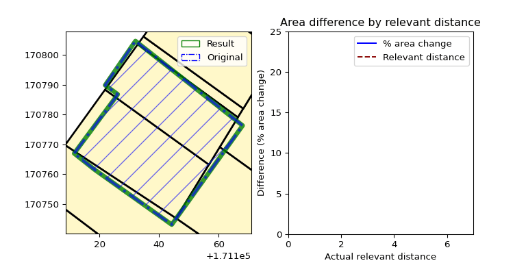

# `brdr`

A Python library for aligning thematic geometries (OGC Simple Features) to reference boundaries.


[](https://doi.org/10.5281/zenodo.11385644)

## Quick links

- [Getting started](getting-started.qmd)
- [Processor selection](processor-selection.qmd)
- [Parameter cookbook](parameter-cookbook.qmd)
- [Examples](examples.qmd)
- [API reference](reference/index.qmd)

## What `brdr` does

`brdr` helps you:

1. Align thematic boundaries to a trusted reference layer.
2. Evaluate geometric change over a range of relevant distances.
3. Detect stable candidate outcomes (`predict` and `evaluate`).
4. Export results and metrics for QA and downstream workflows.

## Core workflow

The minimal workflow is:

1. Create an `Aligner`.
2. Load thematic data.
3. Load reference data.
4. Run `process(...)`, `predict(...)`, or `evaluate(...)`.
5. Export or inspect `AlignerResult`.

```{mermaid}
flowchart LR
    A[Create Aligner] --> B[Load thematic data]
    B --> C[Load reference data]
    C --> D[Run process / predict / evaluate]
    D --> E[Inspect or export AlignerResult]
```

## Visual intuition

The animation below illustrates how results evolve as `relevant_distance` increases.

- Left: thematic geometry, reference layer, and aligned result.
- Right: change metric over distance.

Stable zones in this curve are used for prediction logic.



## Installation

Install from PyPI:

```bash
pip install brdr
```

## Development

### Dependency locking

```bash
PIP_COMPILE_ARGS="-v --strip-extras --no-header --resolver=backtracking --no-emit-options --no-emit-find-links"
pip-compile $PIP_COMPILE_ARGS
pip-compile $PIP_COMPILE_ARGS -o requirements-dev.txt --all-extras
```

### Run tests

```bash
pytest --cov=brdr tests --cov-report term-missing
```

### Docker proof of concept

- [brdr-webservice (Docker POC) on GitHub](https://github.com/dieuska/brdr-webservice)
The repository includes a Docker-based proof of concept for a GRB-specific web service:

```bat
docker build -f Dockerfile . -t grb_webservice
docker run --rm -p 80:80 --name grb_webservice grb_webservice
```

Then open:
`http://localhost:80/docs#/default/actualiser_actualiser_post`

## QGIS integration

`brdrQ` provides a QGIS plugin implementation of `brdr`:

- [brdrQ on GitHub](https://github.com/OnroerendErfgoed/brdrQ/)

## Citation

- Dieussaert, K., Vanvinckenroye, M., Vermeyen, M., & Van Daele, K. (2024). Grenzen verleggen. Automatische correcties van geografische afbakeningen op verschuivende onderlagen. *Onderzoeksrapporten Agentschap Onroerend Erfgoed*. <https://doi.org/10.55465/SXCW6218>

## Feedback and contributions

- Questions and usage discussions: <https://github.com/OnroerendErfgoed/brdr/discussions>
- Bug reports and feature requests: <https://github.com/OnroerendErfgoed/brdr/issues>

## Acknowledgement

This software was created by [Athumi](https://athumi.be/en/) and [Flanders Heritage Agency](https://www.onroerenderfgoed.be/flanders-heritage-agency).


